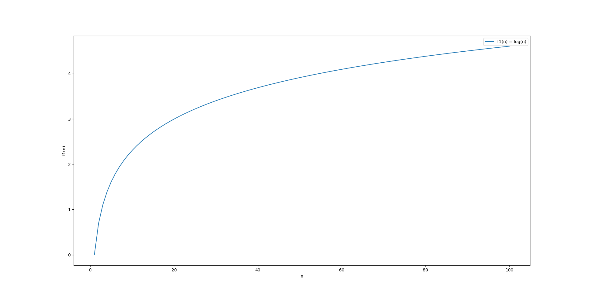

# Merge sort

## Divide and conquer algorithmic technique

Divide and conquer is a technique to solve a problem in sub-problems. For example in Merge Sort uses this technique to divide an array into smaller parts and then merge them together

One of the examples of Divide and conquer technique is finding a maximum number from an array.

```cpp
int findMax(std::vector<int> arr, int low, int high) {
    if (low == high) {
        return arr[low];
    }

    int mid = (low + high) / 2;

    int leftMax = findMax(arr, low, mid);
    int rightMax = findMax(arr, mid + 1, high);

    return std::max(leftMax, rightMax);
}
```

Here is the algorithm

Let's analyze asymptotic behavior of algorithm:

\[
    T(n) = 2 * T (n/2) + 2
\]

We need to use Master's theorem:

For any
\[
    T(n) = aT(n/b) + f(n)    
\]

1. If \(f(n) = O(n^c)\) where \(c < \log_b{a}\), then \(T(n) = \Theta(n^{\log_b{a}})\).
2. If \(f(n) = \Theta(n^{\log_b{a}})\), then \(T(n) = \Theta(n^{\log_b{a}} \log{n})\).
3. If \(f(n) = \Omega(n^c)\) where \(c > \log_b{a}\), and \(af\left(\frac{n}{b}\right) \leq kf(n)\) for some \(k < 1\) and sufficiently large \(n\), then \(T(n) = \Theta(f(n))\).

In our case \(log_b{a} = log_2{2} = 1\) and \(f(n) = 2 = \Theta(1)\) 
At the end we have following equality:
\[
    T(n) = \Theta(n^{log_b{a}}) = \Theta(n^1) = \Theta(n)
\]

## Binary search

Binary search is also divide and conquer algorithm. It recursively breaks the given array into two from the key `k`. It compares the number we are looking with `k`. If `k` is less than the number then it will continue with second part or higher than the number it will continue with first part of array. Same procedure will continue recursively until the number been found.

```cpp
int binary_search(const std::vector<int>& arr, int low, int high, int target) {
    if (low > high) {
        return -1;
    }

    int mid = (low + high) / 2;

    if (arr[mid] == target) {
        return mid;
    } else if (arr[mid] < target) {
        return binary_search(arr, mid + 1, high, target);
    } else {
        return binary_search(arr, low, mid - 1, target);
    }
}
```

Asymptotic behavior

\[
    T(n) = T(n / 2) + 1    
\]

In our case \(a = 1, b = 2\) and \(f(n) = 1 = \Theta(n^{log_2{1}}) = \Theta(n^0) = \Theta(1)\)

Our case is aligning with the second condition \(f(n) = \Theta(n^{log_b{a}})\)

\[
    T(n) = \Theta(log{n})    
\]



## Merge Sort

```cpp

void merge(std::vector<int>& arr, int left, int mid, int right) {
    std::cout << "Merging: ";
    repr_vector(arr, left, right);

    int n1 = mid - left + 1;
    int n2 = right - mid;

    std::vector<int> L(n1), R(n2);

    for (int i = 0; i < n1; ++i)
        L[i] = arr[left + i];

    for (int j = 0; j < n2; ++j)
        R[j] = arr[mid + 1 + j];

    int i = 0, j = 0, k = left;
    while (i < n1 && j < n2) {
        if (L[i] <= R[j]) {
            arr[k] = L[i];
            ++i;
        }
        else {
            arr[k] = R[j];
            ++j;
        }

        ++k;
    }

    while (i < n1) {
        arr[k] = L[i];
        ++k;
        ++i;
    }

    while (j < n2) {
        arr[k] = R[j];
        ++k;
        ++j;
    }

    std::cout << "After merging: ";
    repr_vector(arr, left, right);
}

void merge_sort(std::vector<int>& arr, int left, int right) {
    if (left >= right) return;

    int mid = left + (right - left) / 2;
    merge_sort(arr, left, mid);
    merge_sort(arr, mid + 1, right);

    merge(arr, left, mid, right);
}
```