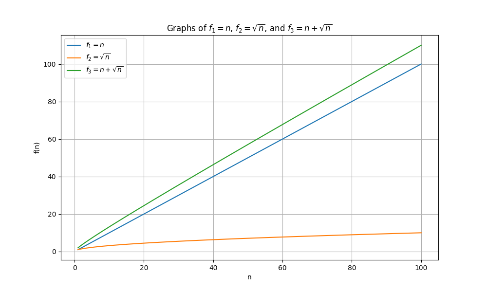

# Lecture 3: Problem session 1

You can find the lecture by clicking [here](https://www.youtube.com/watch?v=IPSaG9RRc-k)

## Asymptotic analysis of functions

Given a function:
\[
    f(x)=x(x+1)(x+2)-5    
\]

Let's analyze asyptotic behavior of the function. 

### Big-O notation

1. First of all we need to simplify by expanding the function
\[
    f(x)=x^3+3n^2+2n-5
\]

2. We need **dominant term** (the part which grows faster than other terms) in polynomial functions we can say the dominant term is the one with **the biggest power**. Here \[x^3\] is the the leading and dominant term. Other terms are insignigicant. Thats why for large enough x, \[f(x)\approx x^3\]. 
3. As x grows we can say that asymptotic behavior of function grows as \[(x-> \infin) x^3\]  

### Problem 1-1

**Asymptotic behavior of functions**
For each of the following sets of five functions, order them so that if f_a appears before f_b in your  sequence, then fa = O(fb). If fa = O(fb) and fb =  (fa) (meaning fa and fb could appear in either order), indicate this by enclosing fa and fb in a set with curly braces. For example, if the functions are: 

\[
f_1=n, \quad f_2=\sqrt{n}, f_3=n+\sqrt{n}    
\]

Here is the graph of the functions:

From the graph, we can see that the function growing the slowest is \( f_2 \). However, \( f_1 \) and \( f_3 \) grow at almost the same rate, so the asymptotic behavior of both functions is \( O(n) \). Here is the ordered format of the functions:

\[
    ( f_2, \{f_1, f_3\} ) \quad or \quad ( f_2, \{f_3, f_1\} )
\]

Here is other problem:

#### a

Asymptotic behavior analysis of the first function:

1. Here \(f_1=(log{n})^2019\) is not a logarithmic function but it is a polynomial function bevause \(log{n}\) gives us a number, let m, and the number should be raised to power *2019*. The worst case behavior of the function is \(O(log{n})^{2019}\).
2. In the second problem we need to simplify logarithm based on its properties 
   \[
    log(n^{2019}) = 2019 * log(n)
   \]
for large n the constant term 2019 does not affect consequently behavior of the function in worst-case scenario is \(O(logn)\). We have second term \(n^2\) with \(O(n^2)\) behavior. 

\[
O(n^2) * O(logn) = O(n * logn)    
\]
3. It is obvious that for the third function worst case is \(O(n^3)\)