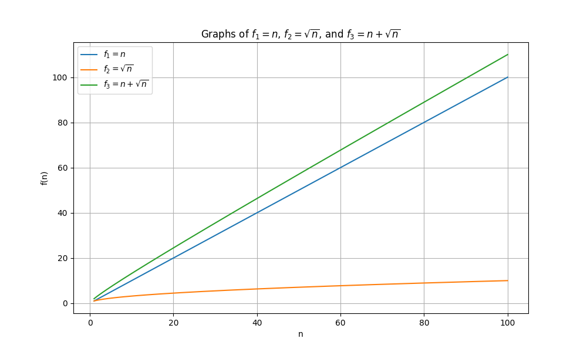
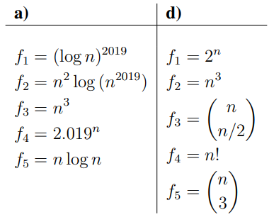
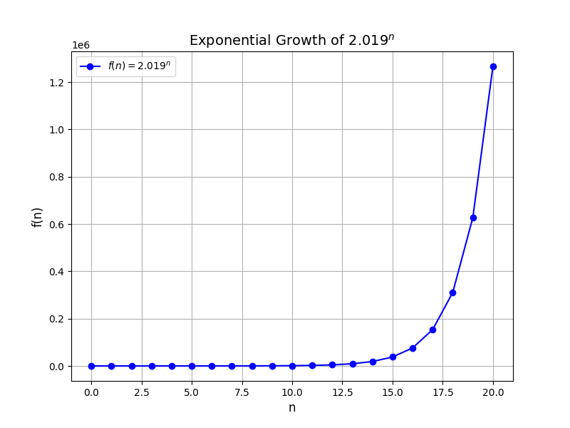
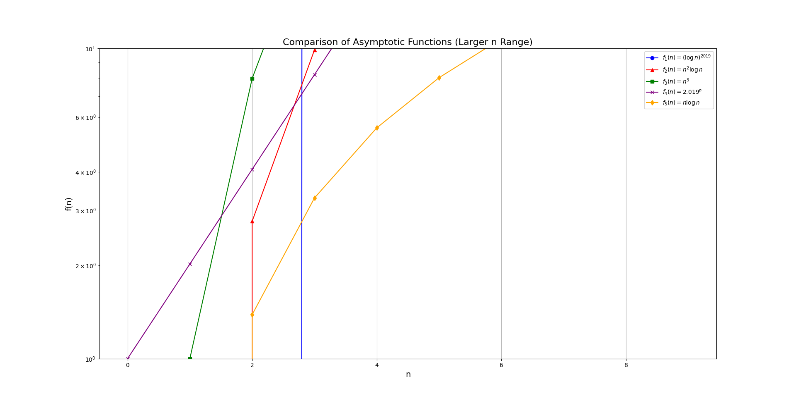

# Lecture 3: Problem session 1

You can find the lecture by clicking [here](https://www.youtube.com/watch?v=IPSaG9RRc-k)

## Asymptotic analysis of functions

Given a function:
\[
    f(x)=x(x+1)(x+2)-5
\]

Let's analyze asyptotic behavior of the function.

### Big-O notation

1. First of all we need to simplify by expanding the function
\[
    f(x)=x^3+3n^2+2n-5
\]

2. We need **dominant term** (the part which grows faster than other terms) in polynomial functions we can say the dominant term is the one with **the biggest power**. Here \[x^3\] is the the leading and dominant term. Other terms are insignigicant. Thats why for large enough x, \[f(x)\approx x^3\].
3. As x grows we can say that asymptotic behavior of function grows as \[(x-> \infin) x^3\]  

### Problem 1-1

**Asymptotic behavior of functions**
For each of the following sets of five functions, order them so that if \(f_a\) appears before \(f_b\) in your  sequence, then \(f_a\) = O(\(f_b\)). If \(f_a\) = O(\(f_b\)) and \(f_b\) =  (\(f_a\)) (meaning fa and fb could appear in either order), indicate this by enclosing \(f_a\) and \(f_b\) in a set with curly braces. For example, if the functions are:

\[
f_1=n, \quad f_2=\sqrt{n}, f_3=n+\sqrt{n}
\]

Here is the graph of the functions:


From the graph, we can see that the function growing the slowest is \( f_2 \). However, \( f_1 \) and \( f_3 \) grow at almost the same rate, so the asymptotic behavior of both functions is \( O(n) \). Here is the ordered format of the functions:

\[
    ( f_2, \{f_1, f_3\} ) \quad or \quad ( f_2, \{f_3, f_1\} )
\]

Here is other problem:


#### a

Asymptotic behavior analysis of the first function:

1. Here \(f_1=(log{n})^{2019}\) is not a logarithmic function but it is a polynomial function bevause \(log{n}\) gives us a number, let m, and the number should be raised to power *2019*. The worst case behavior of the function is \(O((log{n})^{2019})\).
2. In the second problem we need to simplify logarithm based on its properties
   \[
    log(n^{2019}) = 2019 * log(n)
   \]
for large n the constant term 2019 does not affect consequently behavior of the function in worst-case scenario is \(O(logn)\). We have second term \(n^2\) with \(O(n^2)\) behavior.

\[
O(n^2) *O(logn) = O(n * logn)
\]
3. It is obvious that for the third function worst case is \(O(n^3)\)
4. \(2.019^n\) this function is a exponential function. The base is higher than 1, it means it will grow faster than polynomial, linear and logarithmic funciton.

Asymptotic behavior of function is \(O(2.019^n)\)
5. The last function \(O(n*logn)\)



Result
\[
    \{f_1, f_5, f_2, f_3, f_4\}
\]

In the exercise b we are given \(n!\) first we need to analyze its asymptotic behavior. We can use Stirling's approximation:

\[
    n! \approx \sqrt{2\pi n} (\frac{n}{e})^n
\]

As fraction with exponent n grows faster than \(\sqrt{2\pi n}\) therefore for large values of n it will be negligible. Therefore Big-O notation of the function is

\[
    O(\sqrt{n}(\frac{n}{e})^n)
\]

For the function

\[
    \frac{n!}{3!(n-3)!} = \frac{(n-2)(n-1)n}{6}
\]

when we open brakets the leading term will be \(n^3\) therefore Big-O notation is \(O(n^3)\)

For the function \(\frac{n!}{\frac{n}{2}!(n-\frac{n}{2})!}\) we need to simplify the function. After subtracting \(\frac{n}{2}\) from \(n\) we will get \(\frac{n!}{(\frac{n}{2}!)^2}\). For further process we use Starling's approximation and get \(\frac{2^n}{\sqrt{\pi n}}\)

When it comes to ordering the functions here is the result

\[
    \{\{n^3, \frac{n!}{3!(n-3)!}\}, \{ 2^n, \frac{n!}{\frac{n}{2}!(n-\frac{n}{2})!} \}, n! \}
\]

or

\[
    \{ \{f_2, f_5\}, f_3, f_1, f_4 \}
\]

### Problem 1-2

Given a data structure D supporting the four first/last sequence operations:

`D.insert_first(x)`, `D.delete_first()`, `D.insert_last(x)`, `D.delete_last()`, each in \(O(1)\) time, describe algorithms to implement the following higher-level operations in terms of the lower-level operations. Recall that delete operations return the deleted item.

(a) swap ends(D): Swap the first and last items in the sequence in D in O(1) time.

(b) shift left(D, k): Move the first k items in order to the end of the sequence n D in O(k) time. (After, the kth item should be last and the (k + 1)st item should be first.)

#### Problem a

To implement `D.swap_ends()` function with O(1) time complexity using given methods we can create an algorithm with the following steps. First we need to store the value of the first element into a variable, then we can delete the first element and insert the last element into the first position. We should do not forget to delete the last element using `D.delete last()` method. Then we will insert the value of the first element into the last position using `D.insert_last()` method. Here is the algorithm:

```python
class D:
    def __init__(self):
        self.data = []
    
    def insert_first(self, x) -> None:
        self.data.insert(0, x)
    
    def delete_first(self) -> None:
        return self.data.pop(0)
    
    def insert_last(self, x) -> None:
        self.data.append(x)
    
    def delete_last(self) -> None:
        return self.data.pop()
    
    def swap_ends(self):
        first = self.delete_first()
        last = self.delete_last()
        self.insert_first(last)
        self.insert_last(first)
```

#### Problem b

In problem b we need to shift the first k elements to the end of the sequence in O(k) time. We will use `D.delete_first()` and `D.insert_last()` methods to implement the function. First we initialize a loop to iterate k times. In each iteration we will delete the first element and insert it into the last position. Here is the algorithm:

```python
def __init__(self):
        self.data = []
    
    def insert_first(self, x) -> None:
        self.data.insert(0, x)
    
    def delete_first(self) -> None:
        return self.data.pop(0)
    
    def insert_last(self, x) -> None:
        self.data.append(x)
    
    def delete_last(self) -> None:
        return self.data.pop()

    def shift_left(self, k):
        if k > len(self.data):
            return
        
        for i in range(k):
            first = self.delete_first()
            self.insert_last(first)
```
