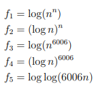
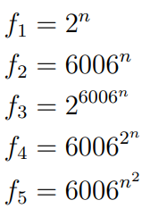
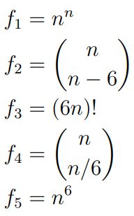
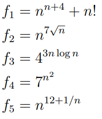

# Problemset 1

## Problem 1-1

### 1-1 a

1) For \(f_1=log(n^n)\) we can say that \(f_1 = n(log({n}))\). \(\Theta(n*log(n))\)
2) For \(f_2 = (log(n))^n\) this case for \(n \to +\infty\) it will grow, while for \(n \to 0^+\) \(f_2=1\). \(\Theta((log(n))^n)\)
3) For \(f_3=log(n^{6006}) = 6006(log(n))\) for large \(n\) 6666 can be negligible. \(\Theta(log(n))\)
4) For \(f_4=(log(n))^{6006}\) it is a logarithmic function, additionally has polynomial growth. Therefore behavior is \(\Theta((log(n))^{6006})\)
5) For \(f_5=log(log(6006n))\) for large values of n constant \(6006\) will be negligible. Therefore behavior is \(\Theta(log(log(n)))\)

Answer:
\[
    \{f_5, \{f_1, f_3\}, f_4, f_2\}
\]

### 1-1 b

1) For the functions \(f_1\) and \(f_2\) it is obvious that \(f_2\) grows faster than \(f_1\)
2) For functions \(f_3\), \(f_4\) and \(f_5\) for large values of \(n\) \(f_3\) grows faster, after that \(f_4\)

Answer:
\[
    \{f_1, f_2, f_5, f_4, f_3\}    
\]

### 1-1 c

1) Function \(f_1\) grows extemely fast and its behavior is \(\Theta(n^n)\)
2) We need to simplify the \(f_2\)
\[
    f_2 = \frac{n!}{(n-6)!} = \frac{n(n-1)...(n-5)}{6!}
\]

In the simplified part largest term is \(n^6\). We can neglect other terms. \(\Theta(n^6)\)

3) We can use Stirling's method to approximate 
\[
    f_3 = (6n)! \approx \sqrt{12\pi n}(\frac{6n}{e})^{6n} \\
\]

For large values of \(n\) 6 and \(12 \pi\) is negligible, does not affect too much. After that we leave with \(\sqrt{n}(\frac{n}{e})^n\). For large values of \(n\) \(e\) can be negligible. At the end we have this behavior: \(\Theta(n^n)\)

4) Now it is time to function \(f_4\)

\[
    f_4 = \frac{n!}{(n/6)!} \approx \frac{n^{n-6} + (\text{remaining part})}{\frac{n^5}{6^5}}
\]

Here also for large values of \(n\) we can neglect (remaining part) and \(6^5\). We remain with
\[
    \frac{n^{n-6}}{n^5} = n^{n-11}
\]

For large values of \(n\) behavior of the function will be \(\Theta(n^n)\)

At the end we have following answer

\[
    \{\{f_2, f_5\}, \{f_1, f_3, f_4\}\}    
\]

### 1-1 d

1) Obviusly after some operations we get \(\Theta(n^n)\)
2) For the second \(\Theta(n^{\sqrt{n}})\)
3) For the third \(\Theta(4^{nlog(n)})\)
4) For the forth function we need to do some operations
\[
    7^{n^2} = e^{ln(7^{n^2})} = e^{n^2ln(7)} \\
    \text{It grows very fast for large values of n}
\]

Behavior is: \(\Theta(7^{n^2})\)

5) For the last function we \(\Theta(n^{12})\)

Answer:
\[
    \{f_5, f_3, f_4, f_2 ,f_1\}    
\]